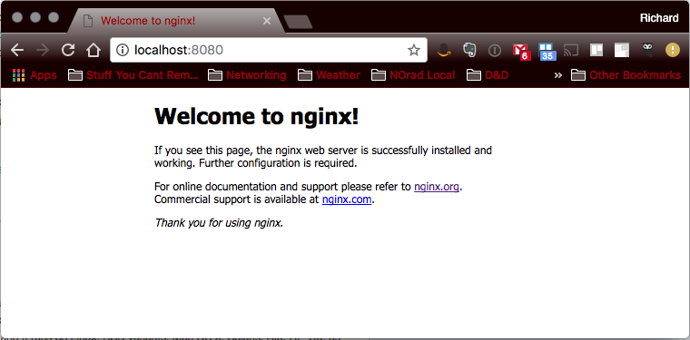

# Pull and Run an Image

Docker Documentation References:

[docker pull](https://docs.docker.com/engine/reference/commandline/pull/)

[docker run](https://docs.docker.com/engine/reference/commandline/run/)

##Intent

The purpose of this kata is to familarize yourself with the process of pulling an image from a repository and running it.

##Overview

In this exercise we will pull an image for the NGINX Web Server and run it using only defaults. Later we will use this image to demostrate other features of docker.

##Kata Steps

###Pull a simple image, nginx:alpine

**Command**

```bash
docker pull nginx:alpine
```

**Output**

```bash
thought:DockerKata rich$ docker pull nginx:alpine
alpine: Pulling from library/nginx
cfc728c1c558: Pull complete
59e0e447b6ec: Pull complete
1c89b5c5bd38: Pull complete
584d454ad7fd: Pull complete
Digest: sha256:33eb1ed1e802d4f71e52421f56af028cdf12bb3bfff5affeaf5bf0e328ffa1bc
Status: Downloaded newer image for nginx:alpine
```

###Run the nginx image

**Command**

```bash
docker run nginx:alpine
```

**Output**

```bash
thought:DockerKata rich$ docker run nginx:alpine
```

###Test the running container

**Command** (in another terminal):

```bash
open http://localhost:8080
```

Or [click here](http://localhost:8080)

**Output**



###Stop the running container

Use `Ctrl-C` on the command line where you executed 

[Previous](#) | [Index](README.md) | [Next](2_list_images.md)

