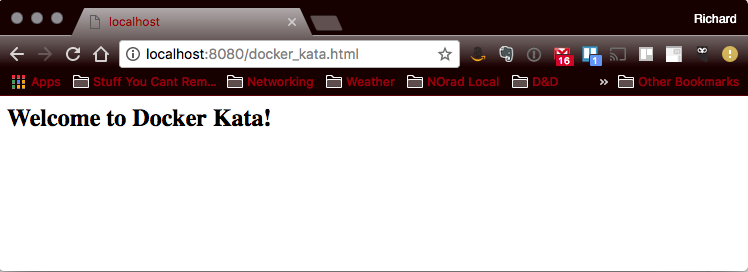

# Mounting Volumes

Docker Documentation References:

[docker run](https://docs.docker.com/engine/reference/commandline/run/)

### Intent

The purpose of this kata is to familiarize yourself with the process of exposing a network port on a running Docker Container

### Overview

In this exercise we will run a simple [NGINX](http://nginx.org/) image, publish its network interface, and mount our localdisk to to it. 

### Kata Steps

**Command:**

```bash
docker run --detach --publish 8080:80 --volume html:/usr/share/nginx/html:ro nginx:stable-alpine
```

> Here, --detach causes the container to run as a daemon and --publish maps localhost port 8080 to the containers port 80. --volume binds the disk location `/usr/share/nginx/html` to our local folder `html`. The :ro at the end makes the binding read-only.

**Output:**

```bash
thought:DockerKata rich$ docker run --detach --publish 8080:80 --volume `pwd`/html:/usr/share/nginx/html:ro nginx:stable-alpine
12eb58d7778e5b561f912d5f42d0240b3ad82d5f7d384c57c7984b74d70f7e33
```

##### Test the running container

**Command** (in another terminal):

```bash
open http://localhost:8080/docker_kata.html
```

Or [click here](http://localhost:8080/docker_kata.html)



##### Stop the running container

**Command**

```bash
docker stop 12eb58d7778e5b561f912d5f42d0240b3ad82d5f7d384c57c7984b74d70f7e33
```

**Output**

```bash
thought:DockerKata rich$ docker stop 12eb58d7778e5b561f912d5f42d0240b3ad82d5f7d384c57c7984b74d70f7e33
12eb58d7778e5b561f912d5f42d0240b3ad82d5f7d384c57c7984b74d70f7e33
```


[Previous](19_publish_network_interfaces.md) | [Index](README.md) | [Next](#)
